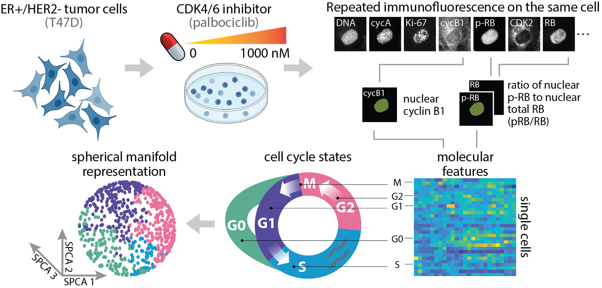

# SPCA on Single-Cell Breast Tumor Data

## Overview 

## Introduction 
Spherical principal component analysis (SPCA) is a manifold approximation method that assumes high-dimensional data lie on a low-dimensional sphere. We performed SPCA on multiplex, single-cell profiles of ER+/HER2- breast tumor cells (T47D) treated with varying doses of palbociclib, a CDK4/6 inhibitor. Here, we show that SPCA is an ideal method for preserving the inherent geometric structure of cell cycle data and characterizing dose response in comparison to manifold structures identified by Potential of Heat-diffusion for Affinity-based Trajectory Embedding (PHATE) and principal component analysis (PCA). Using SPCA manifolds as a low-dimensional embedding for trajectory inference, Slingshot identified cell cycle trajectories that validated known cyclical trends of protein expression and pointed to potential mechanisms of CDK4/6 inhibitor resistance. 

## Installation 
- Clone the git repository: 
'''
git clone https://github.com/PurvisLabTeam/singlecell_spca.git
'''

## Dependencies 
Data analysis was performed using Python (v3.11.6) and R (v4.2.3). NumPy (v1.26), pandas (v2.1.3), scikit-learn (v1.3.2), SciPy (v1.11.14), loess (v2.1.2), and phate (v1.0.11) Python libraries were used to perform SPCA, PCA, PHATE, and other statistical analyses. Seurat (v4.3.0), slingshot (v2.6.0), tidyr (v1.3.0), and dplyr (v1.1.2) R packages were used to perform Slingshot. The matplotlib (v3.8.2) Python library was used for data visualization. 

## Description 
- [data/T47D.csv](./data/T47D.csv) 
- [utils.py](./utils.py)
- [methods.ipynb](./methods.ipynb)
- [method_comparisons.ipynb](./method_comparisions.ipynb)
- [ti/spca_traj.Rmd](./ti/spca_traj.Rmd)
- [ti/pca_traj.Rmd](./ti/pca_traj.Rmd)
- [ti/phate_traj.Rmd](./ti/phate_traj.Rmd)

## Supplemental Figures 

## License 
This software is licensed under the [MIT license](https://opensource.org/licenses/MIT).